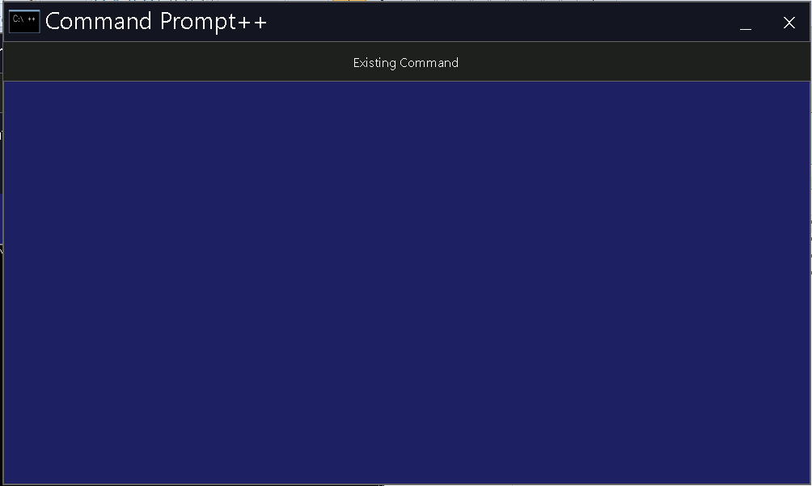

# VB-cmd-project
CMD++ , this is unfinished project in Visual Studio 2010. Can modified in higher version of VS. 

i want to somebody to continue this project.

the concept of this project is to create a cmd that having a clickalbe function, to help the user. 

screenshot

